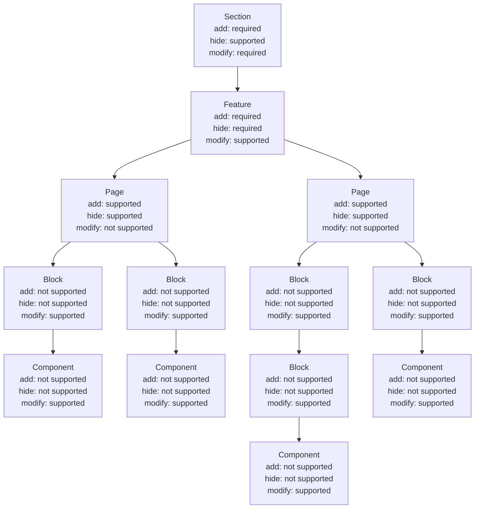

```mermaid
flowchart TD
	section["Section<br/>add: required<br/>hide: supported<br/>modify: required"]
	feature["Feature<br/>add: required<br/>hide: required<br/>modify: supported"]

	pageLeft["Page<br/>add: supported<br/>hide: supported<br/>modify: not supported"]
	pageRight["Page<br/>add: supported<br/>hide: supported<br/>modify: not supported"]

	blockLeftA["Block<br/>add: not supported<br/>hide: not supported<br/>modify: supported"]
	blockLeftB["Block<br/>add: not supported<br/>hide: not supported<br/>modify: supported"]
	blockRightA["Block<br/>add: not supported<br/>hide: not supported<br/>modify: supported"]
	blockRightB["Block<br/>add: not supported<br/>hide: not supported<br/>modify: supported"]
	blockNested["Block<br/>add: not supported<br/>hide: not supported<br/>modify: supported"]

	componentLeftA["Component<br/>add: not supported<br/>hide: not supported<br/>modify: supported"]
	componentLeftB["Component<br/>add: not supported<br/>hide: not supported<br/>modify: supported"]
	componentRightA["Component<br/>add: not supported<br/>hide: not supported<br/>modify: supported"]
	componentRightB["Component<br/>add: not supported<br/>hide: not supported<br/>modify: supported"]

	section --> feature
	feature --> pageLeft
	feature --> pageRight

	pageLeft --> blockLeftA
	pageLeft --> blockLeftB
	pageRight --> blockRightA
	pageRight --> blockRightB

	blockLeftA --> componentLeftA
	blockLeftB --> componentLeftB
	blockRightA --> blockNested
	blockRightB --> componentRightB
	blockNested --> componentRightA
```
