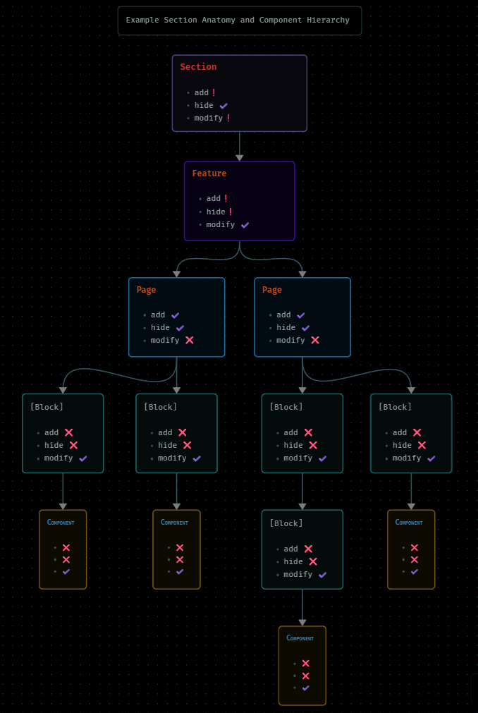
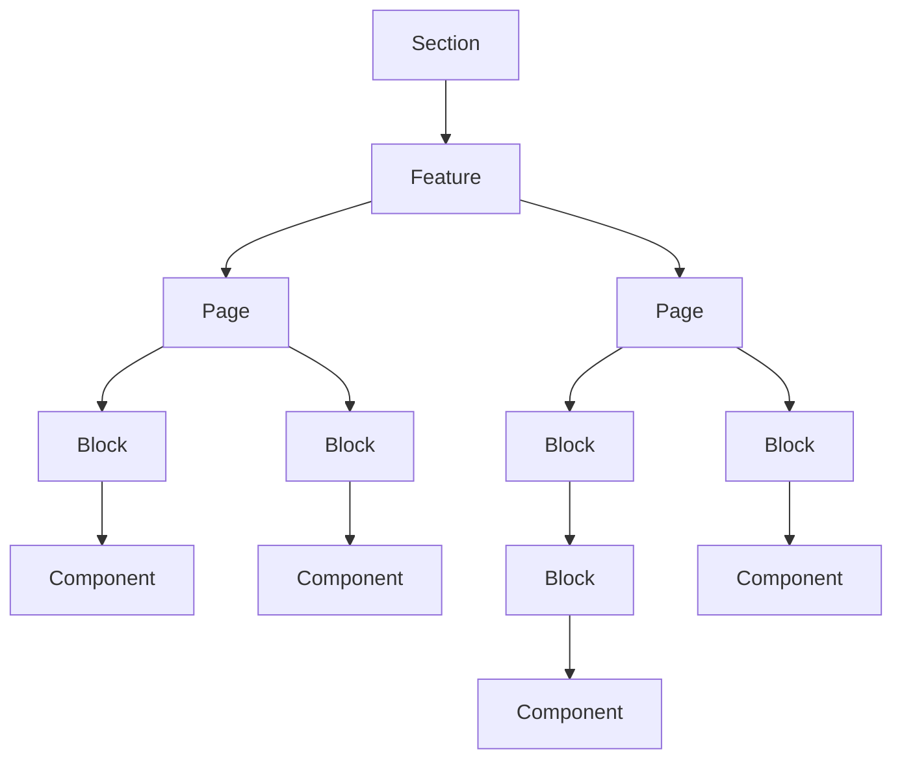

## Legend

| Component   | Add           | Hide          | Modify        |
| ----------- | ------------- | ------------- | ------------- |
| Section     | at risk       | supported     | at risk       |
| Feature     | at risk       | at risk       | supported     |
| Page        | supported     | supported     | not supported |
| Block       | not supported | not supported | supported     |
| Component   | not supported | not supported | supported     |
