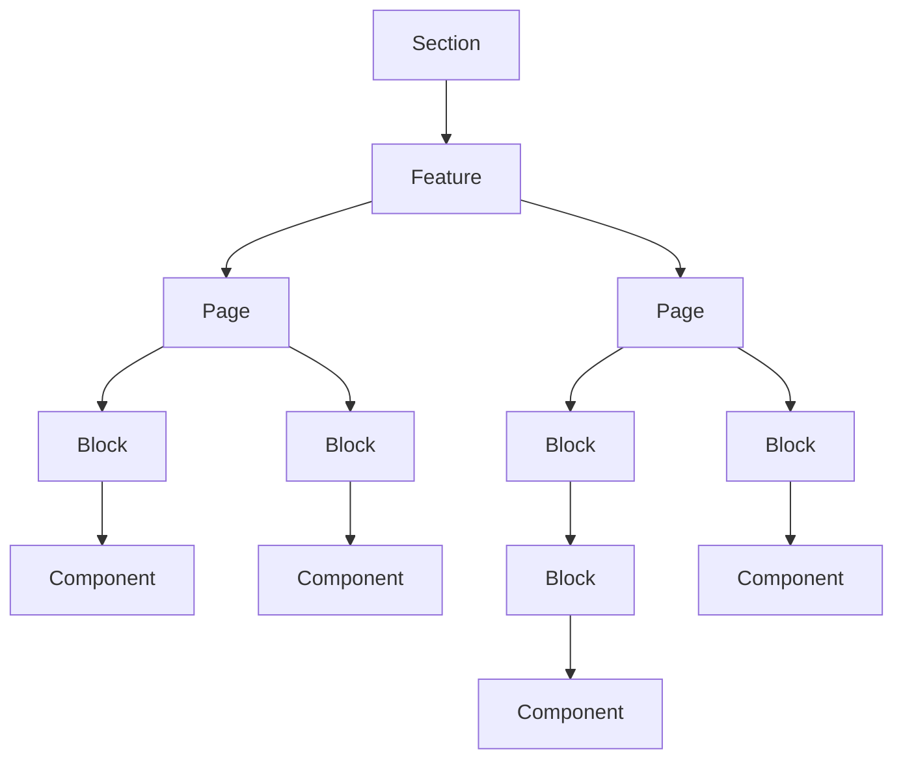

# Components Diagram
> One example "Section" contains one or more "Features". Each "Feature" contains one or more "Pages". Each "Page" contains one or more "Blocks". Each "Block" contains one or more "Components". The CMS allows for adding, hiding, and modifying these components, but the scope of what is included in the base project varies by component type. For details on what is included in the base scope, please refer to: [Scope Summary v1](../SCOPES/PRD_6K.md#scope-summary-v1)

## Legend

| Component       | Add           | Hide          | Modify        |
| --------------- | ------------- | ------------- | ------------- |
| **Section**     | at risk       | supported     | at risk       |
| **Feature**     | at risk       | at risk       | supported     |
| **Page**        | supported     | supported     | not supported |
| **Block**       | not supported | not supported | supported     |
| **Component**   | not supported | not supported | supported     |
